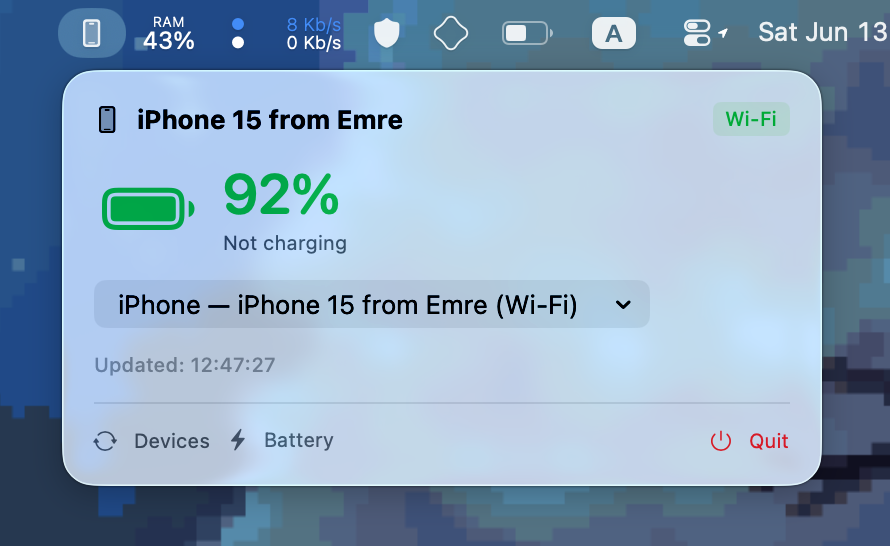

### PocketSpark

Minimal macOS system tray iPhone battery info.



I wanted to have a quick and cool way of seeing my iPhone battery when I'm on my mac as an EU user.
As Apple still has not enabled the iPhone Mirroring in the EU, I've decided to add a battery info in the system tray.

It features USB and WIFI support.

There are 2 requirements for this app:

1. Install this neet brew package:

```sh
brew install libimobiledevice
```

From which the macOS app basically does these 3 commands:

```sh
ideviceinfo -n -k DeviceName                   
ideviceinfo -n -q com.apple.mobile.battery -k BatteryCurrentCapacity
ideviceinfo -n -q com.apple.mobile.battery -k BatteryIsCharging
```

2. Connect your iPhone at least once via USB, verifying that the app works. After that the app should also work on a WIFI connection.


Feel free to open issues and I hope you like this app!
